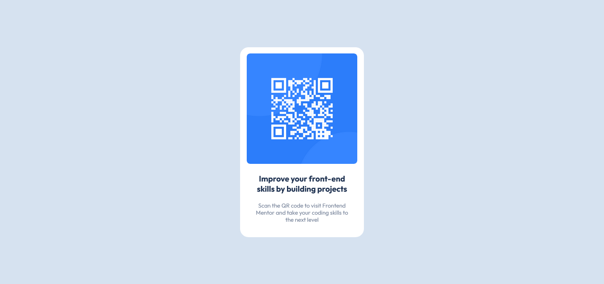

# Frontend Mentor - QR code component solution

This is a solution to the [QR code component challenge on Frontend Mentor](https://www.frontendmentor.io/challenges/qr-code-component-iux_sIO_H).

## Table of contents

- [Overview](#overview)
  - [Screenshot](#screenshot)
  - [Links](#links)
- [My process](#my-process)
  - [Built with](#built-with)
  - [What I learned](#what-i-learned)    
- [Author](#author)
- [Acknowledgments](#acknowledgments)

## Overview

### Screenshot



### Links

- Solution URL: [https://github.com/gabrielpgf/qr-code-component-main](https://github.com/gabrielpgf/qr-code-component-main)
- Live Site URL: [Add live site URL here](https://your-live-site-url.com)

## My process

### Built with

- Semantic HTML5 markup
- CSS custom properties

### What I learned

In this project, I learned how to correctly center elements using the position and transform properties.

```css
.container_qr {
  position: absolute;    
  top: 50%;
  left: 50%;
  transform: translate(-50%, -50%); 
}
```

Also, I got to know the hsl property for defining colors, saturation and brightness.

```css
.msgBold {
    color: hsl(218, 44%, 22%);   
}
```

## Author

- Frontend Mentor - [@gabrielpgf](https://www.frontendmentor.io/profile/gabrielpgf)
- Twitter - [@GabrielPGF](https://twitter.com/GabrielPGF)

## Acknowledgments

This article helped me how to correctly center elements using CSS.

https://www.freecodecamp.org/portuguese/news/como-centralizar-tudo-com-css/

Also, the article below helped me better understand the use of hsl (Hue, Saturation and Lightness).

https://www.maujor.com/tutorial/css3-modulo-para-cores.php#:~:text=A%20declara%C3%A7%C3%A3o%20de%20cores%20com,%3D%20satura%C3%A7%C3%A3o%20e%20Lightness%20%3D%20luminosidade.&text=O%20valor%20do%20%C3%A2ngulo%20segue,trigonometria%20para%20medida%20de%20%C3%A2ngulos.

